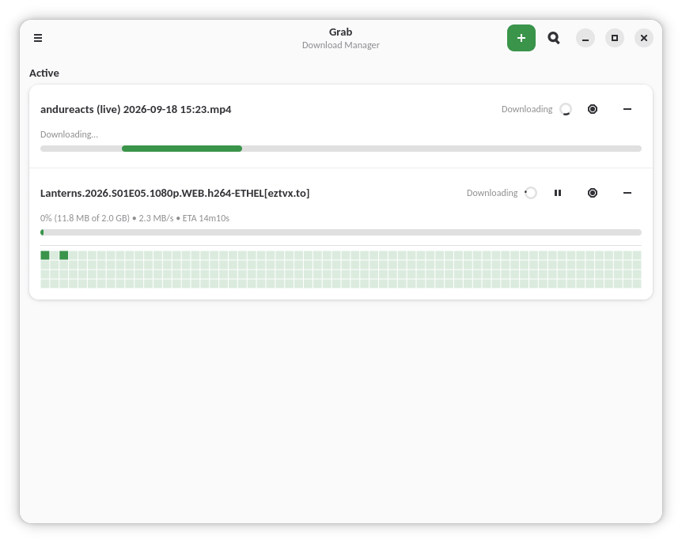
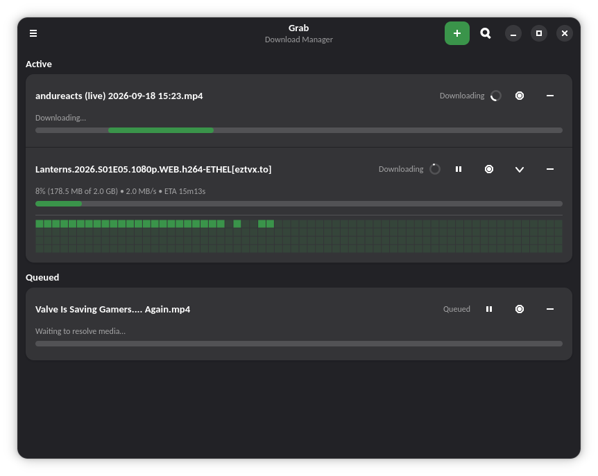
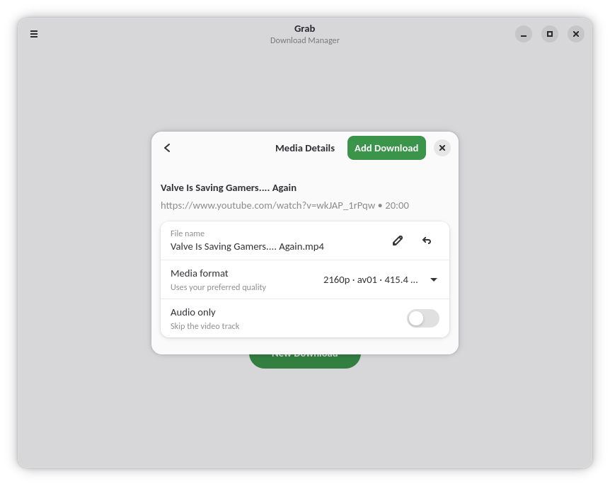
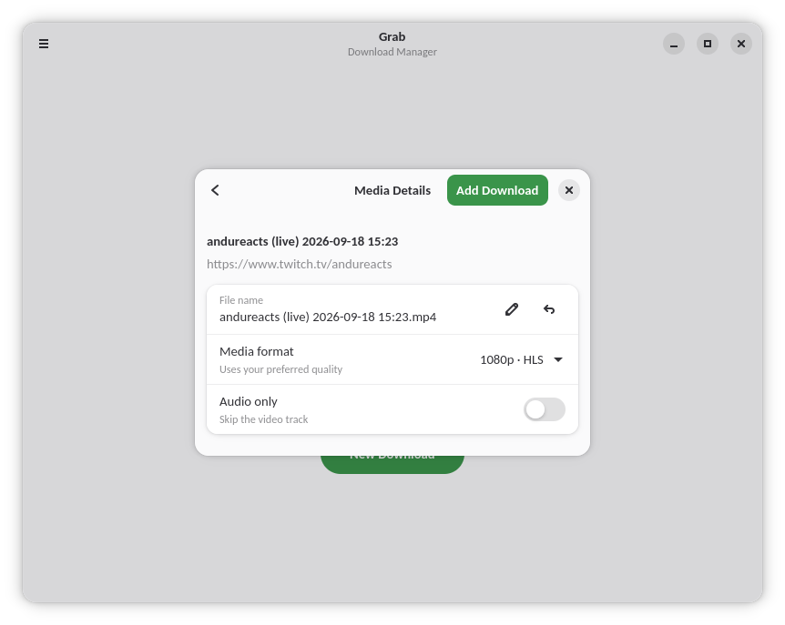
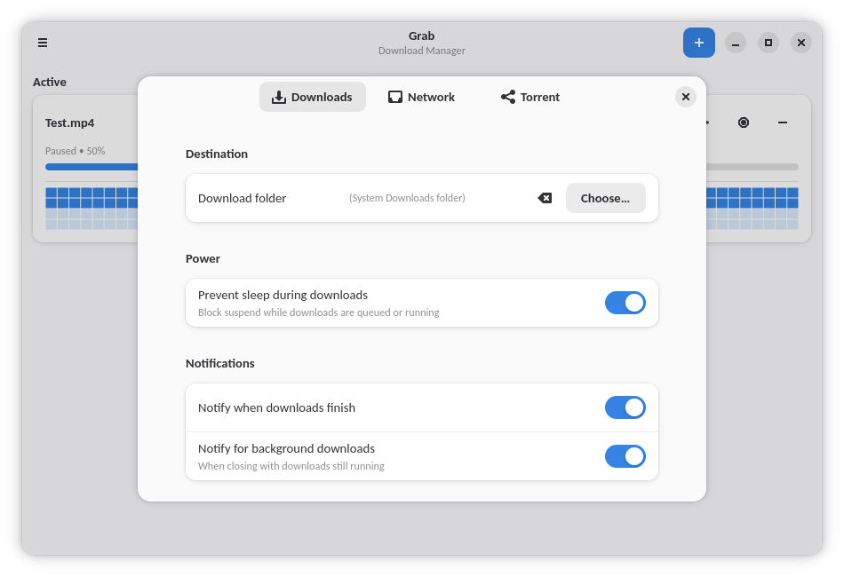
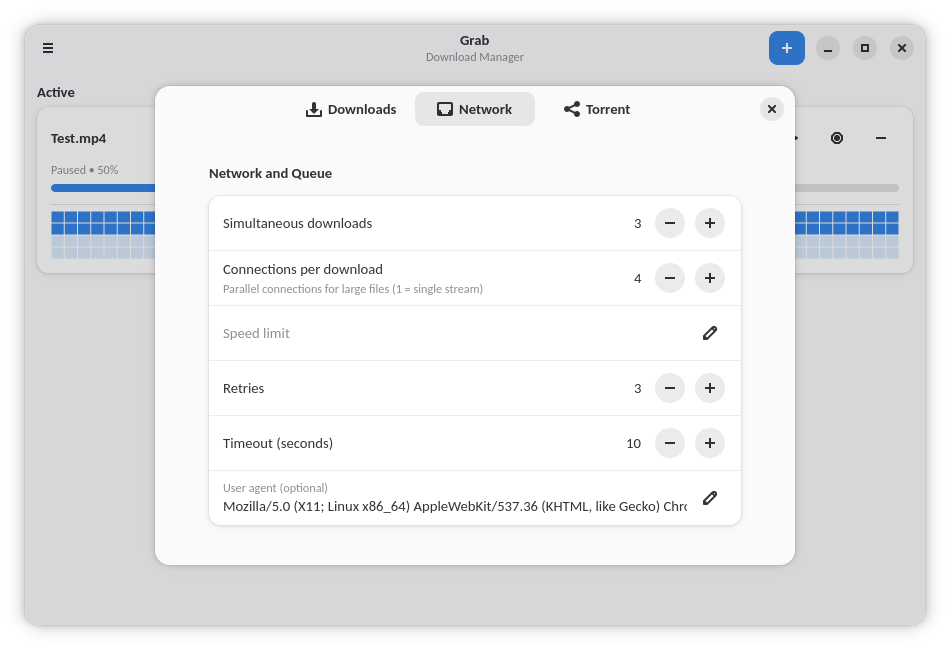
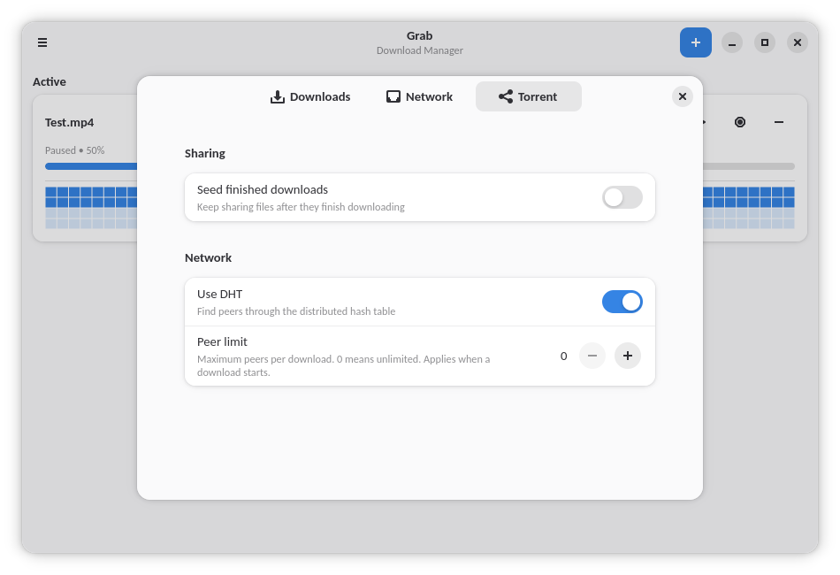
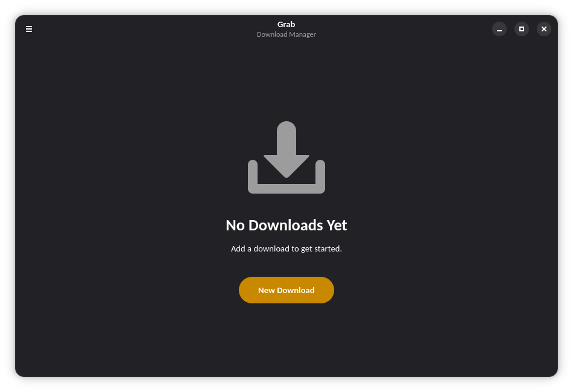

# Grab

A download manager for GNOME. Built with GTK 4 and libadwaita.

## Screenshots

<p align="center">
  
  <br>
  <em>Active downloads: indeterminate live capture plus segmented torrent with block map</em>
</p>

<p align="center">
  
  <br>
  <em>Active and queued sections with expanded segment map (dark mode)</em>
</p>

<p align="center">
  
  <br>
  <em>Media details: quality picker with per-format sizes</em>
</p>

<p align="center">
  
  <br>
  <em>Media details for a live stream: HLS variant picker</em>
</p>

<p align="center">
  <picture>
    <source media="(prefers-color-scheme: dark)" srcset="screenshots/dark-prefs-downloads.png">
    
  </picture>
  <br>
  <em>Preferences: destination, power, and notifications</em>
</p>

<p align="center">
  
  <br>
  <em>Preferences: simultaneous downloads, connections, retries, speed limit</em>
</p>

<p align="center">
  
  <br>
  <em>Preferences: seeding, DHT, and peer limit</em>
</p>

<p align="center">
  
  <br>
  <em>Empty state (dark mode)</em>
</p>

## Install

From FlatPark (recommended, gets updates via `flatpak update`):

```bash
flatpak remote-add --if-not-exists flatpark https://dl.flatpark.org/flatpark.flatpakrepo
flatpak install flatpark io.github.houssemko.Grab
```

Or manually from the [latest release](https://github.com/houssemko/Grab/releases):

```bash
flatpak install --user Grab.flatpak
```

### Cookies from a browser in a custom location (Flatpak)

The sandbox can only read the standard profile locations. If your browser
keeps its profile elsewhere, grant read access with:

```bash
flatpak override --user --filesystem=~/.config/my-browser:ro io.github.houssemko.Grab
```

Undo with `flatpak override --user --reset io.github.houssemko.Grab`.

## Notes for packagers

Flatpak-only.

```bash
flatpak-builder --user --install build build-aux/io.github.houssemko.Grab.json
```

## License

Grab is free software: you can redistribute it and/or modify it under the
terms of the GNU General Public License as published by the Free Software
Foundation, version 3 only. See [LICENSE](LICENSE) for the full text.
